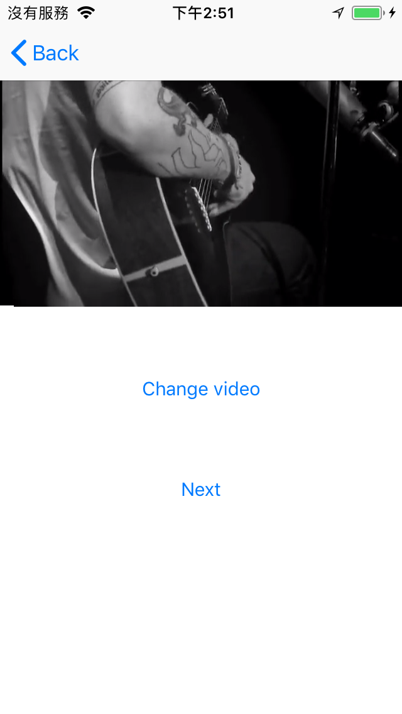
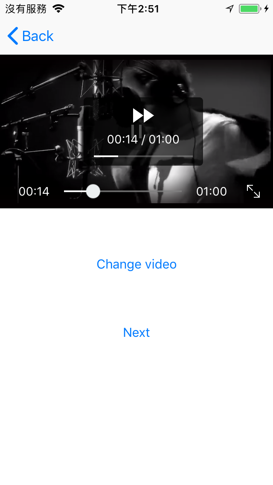
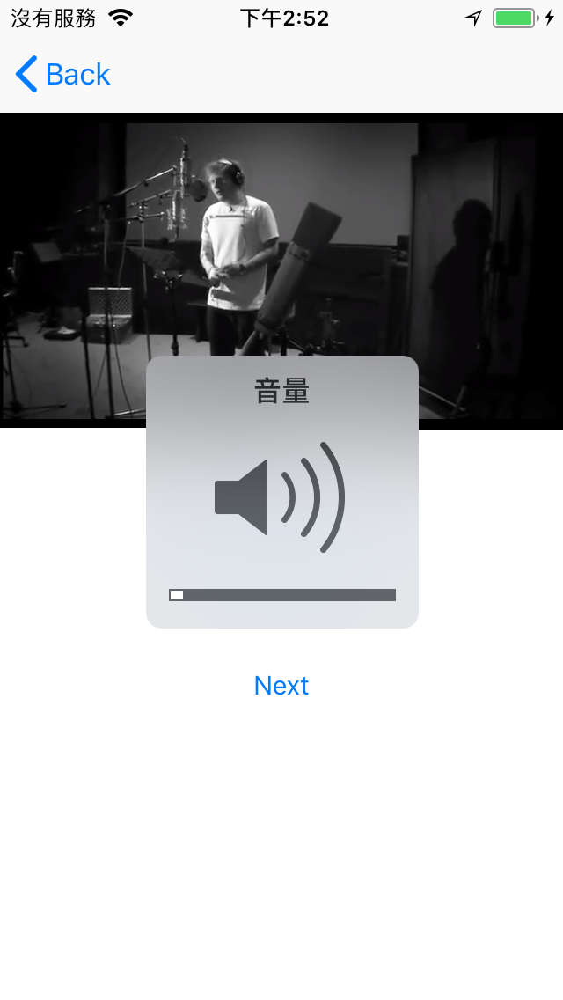
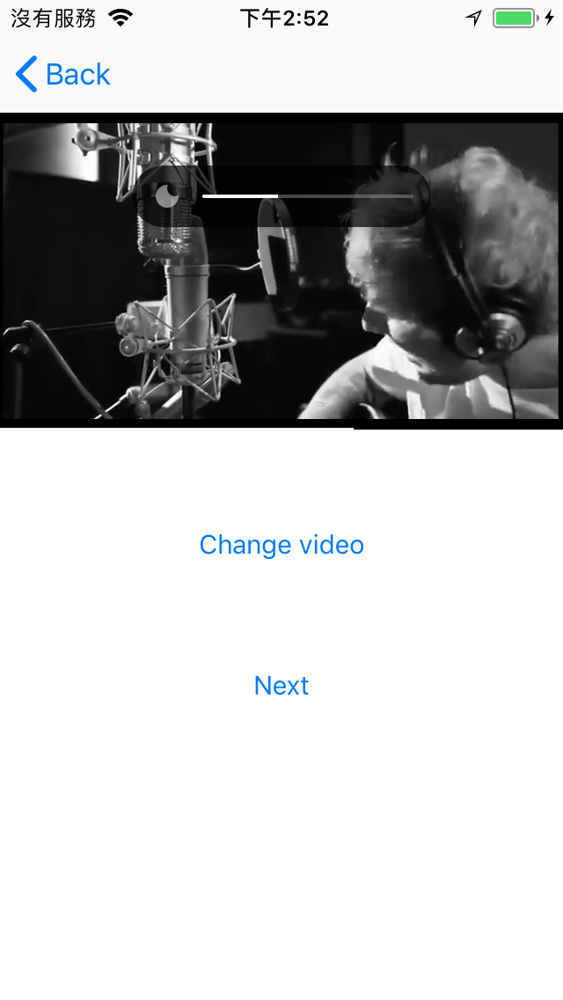
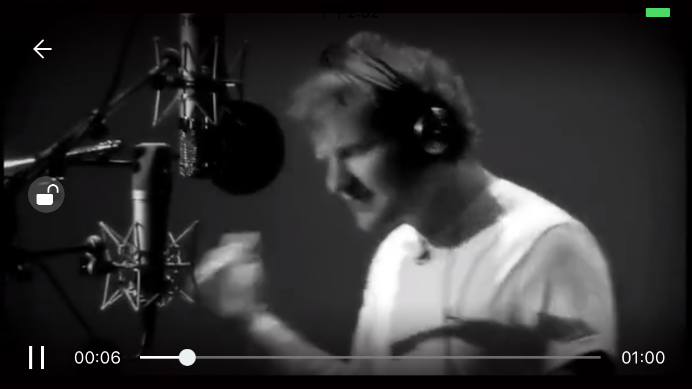

# IRPlayerUIShell 

- IRPlayerUIShell is a powerful UI Shell framework for the video player([IRPlayer](https://github.com/irons163/IRPlayer-swift)) for iOS.
- Objc version: https://github.com/irons163/IRPlayerUIShell

## Features
- Support customize UI for [IRPlayer](https://github.com/irons163/IRPlayer-swift).
- Support some media controllers.
    - Seek Bar
    - Brightness
    - Volume
    - Full Screen
- Has a Demo

## Future
- Support Multi video player in one page(UITableView, UICollectionView, etc).
- More powerful custom UI design.
- Make a framework for this project.

## Install
### Git
- Git clone this project.

### Cocoapods
- Not support yet.

## Usage

### Basic
- See `IRPlayerUIShellViewController` for demo.

- Create a [IRPlayer](https://github.com/irons163/IRPlayer-swift) instance.
```swift
import IRPlayer

// Create the decoder and PlayerImp
let playerImp: IRPlayerImp = {
    let p = IRPlayerImp.player()
    p.decoder = IRPlayerDecoder.ffmpegDecoder()
    // Single video example
    if let url = URL(string: "https://example.com/video.mp4") {
        p.replaceVideo(with: url)
    }
    return p
}()
```

- Create `IRPlayerController` with `playerManager` and `containerView`, then set the `controlView`:
```swift
let containerView = UIView()
let controlView = IRPlayerControlView() // Adjust to your concrete control view type

let player = IRPlayerController.player(withPlayerManager: playerImp,
                                       containerView: containerView)
player.controlView = controlView
```

- Provide multiple video URLs — the first one will auto‑play:
```swift
let assetURLs: [URL] = [
    URL(string: "https://example.com/video1.mp4")!,
    URL(string: "https://example.com/video2.mp4")!
]
player.assetURLs = assetURLs
```

## Advanced Settings

- Keep playing when the app resigns active (background):
```swift
player.pauseWhenAppResignActive = false
```

- Listen for orientation/fullscreen changes:
```swift
player.orientationWillChange = { [weak self] (_, _) in
    self?.setNeedsStatusBarAppearanceUpdate()
}
```

- Listen for when the player reaches the end of the current item:
```swift
player.playerDidToEnd = { [weak player, weak controlView] _ in
    guard let player, let controlView else { return }

    // Pause then play again (retains your original behavior)
    player.currentPlayerManager.pause()
    player.currentPlayerManager.play()

    // Play next item
    player.playTheNext()

    if !player.isLastAssetURL {
        let title = "title:\\(player.currentPlayIndex)"
        controlView.showTitle(title,
                              coverURLString: kVideoCover,
                              fullScreenMode: .landscape)
    } else {
        player.stop()
    }
}
```

- More, coming soon...


## Screenshots
|Play|Seek|
|:---:|:---:|
|||
|Volume|Brightness|
|||
|Full Screen|Lock Screen|
|||


## Copyright
##### This project is inspired from [ZFPlayer](https://github.com/renzifeng/ZFPlayer).
